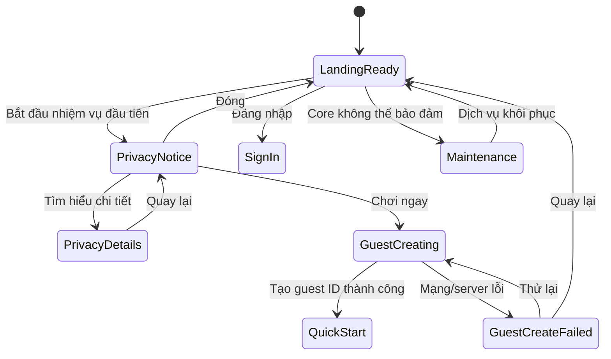
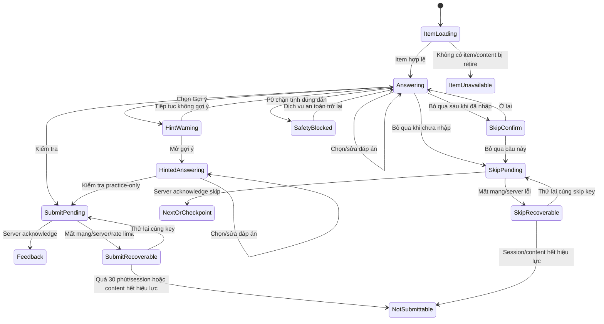
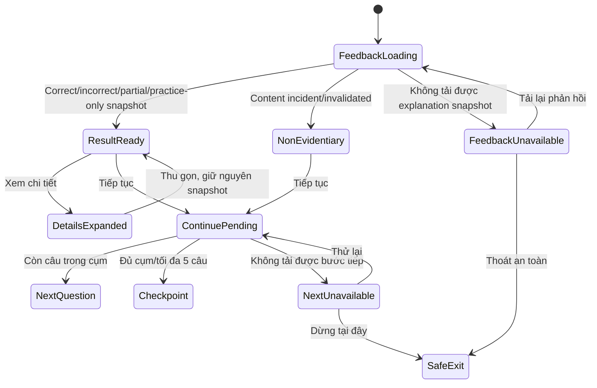
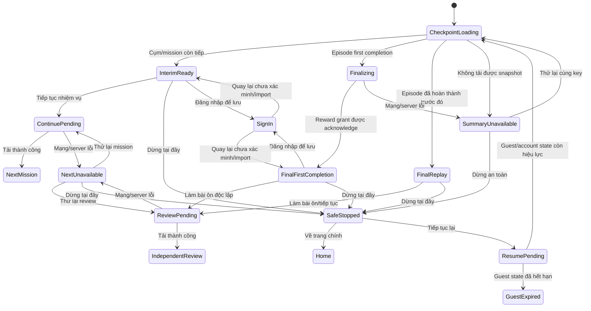
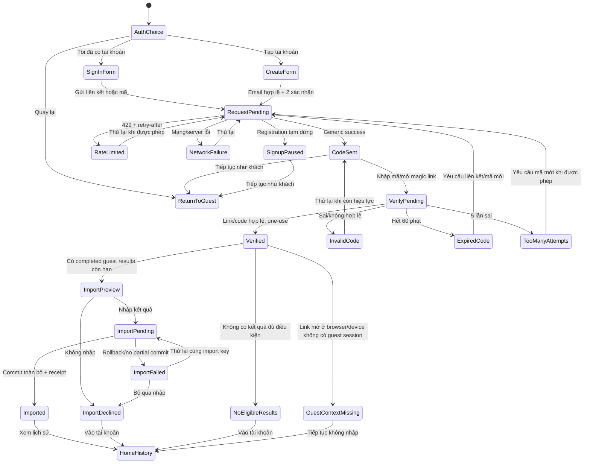

# Vertical Slice wireframes

> Trạng thái: ACCEPTED — đủ năm wireframe pre-code; Codex heuristic review không còn P0/P1  
> Định dạng: Markdown thuần, lưu cùng repository  
> Phạm vi: năm luồng pre-code của Vertical Slice  
> Đã hoàn thành: WF-01 Landing, WF-02 Question, WF-03 Feedback, WF-04 Checkpoint/safe stop, WF-05 Sign-in/guest import

## 1. Mục đích và ranh giới

Tệp này là nguồn bàn giao wireframe cho Landing, Question, Feedback, Checkpoint/safe stop và Sign-in/guest import. Yêu cầu và phương pháp review nằm trong [PROTOTYPE-PLAN.md](PROTOTYPE-PLAN.md); hành vi sản phẩm chi tiết vẫn theo [UX-FLOWS.md](UX-FLOWS.md).

Wireframe ở đây dùng để kiểm tra hierarchy, nội dung, trạng thái, responsive behavior và accessibility trước khi code. Đây không phải prototype tương tác, không phải thiết kế high-fidelity và không thay thế visual tokens trong [VISUAL-DIRECTION.md](VISUAL-DIRECTION.md).

## 2. Quy ước trình bày

Mỗi luồng phải có:

1. mục tiêu người dùng và điểm vào/ra;
2. sơ đồ chuyển trạng thái bằng Mermaid;
3. khung điện thoại bằng text trong code fence;
4. ghi chú chuyển đổi sang desktop, không cần vẽ lại mọi chi tiết không đổi;
5. bảng trạng thái gồm default, loading, success và các lỗi/empty/disabled có liên quan;
6. thứ tự keyboard/focus, nhãn accessibility quan trọng và reduced-motion behavior;
7. liên kết đến acceptance criteria;
8. finding heuristic P0–P3 và cách xử lý.

Text diagram chỉ mô tả cấu trúc, không cố định kích thước pixel. Mỗi phần tử tương tác dùng mã ổn định dạng `LND-CTA-01`, `QST-HINT-01` để finding và implementation có thể tham chiếu mà không phụ thuộc số dòng.

## 3. Responsive baseline

- **Phone reference:** 390 × 844 CSS px; nội dung chính một cột và CTA thiết yếu không bị bàn phím ảo che.
- **Desktop reference:** 1440 × 900 CSS px; giới hạn chiều rộng đọc, không kéo prompt thành dòng quá dài.
- **Tablet:** suy ra từ hai reference bằng breakpoint/rule được ghi trong từng luồng; chỉ tạo khung riêng nếu phát hiện rủi ro bố cục.
- Không xem kích thước reference là danh sách thiết bị hỗ trợ; acceptance vẫn dựa trên responsive behavior và browser matrix của dự án.

## 4. Chỉ mục tiến độ

| ID | Luồng | Phone | Desktop rules | State map | Accessibility | Heuristic review |
|---|---|---|---|---|---|---|
| WF-01 | Landing | Hoàn thành | Hoàn thành | Hoàn thành | Hoàn thành | Đạt — không còn P0/P1 |
| WF-02 | Question | Hoàn thành | Hoàn thành | Hoàn thành | Hoàn thành | Đạt — không còn P0/P1 |
| WF-03 | Feedback | Hoàn thành | Hoàn thành | Hoàn thành | Hoàn thành | Đạt — không còn P0/P1 |
| WF-04 | Checkpoint/safe stop | Hoàn thành | Hoàn thành | Hoàn thành | Hoàn thành | Đạt — không còn P0/P1 |
| WF-05 | Sign-in/guest import | Hoàn thành | Hoàn thành | Hoàn thành | Hoàn thành | Đạt — không còn P0/P1 |

Không đổi một ô sang `Hoàn thành` cho đến khi artifact tương ứng có đủ default state, critical error/interruption state và accessibility notes.

Thứ tự duyệt cố định: `WF-01 → WF-02 → WF-03 → WF-04 → WF-05`. Một wireframe chỉ được đóng khi heuristic review không còn P0/P1 và rationale đã được ghi. Codex tự chốt các lựa chọn thông thường; chỉ hỏi chủ dự án nếu thay đổi ảnh hưởng đáng kể tới scope, chi phí, pháp lý, dữ liệu hoặc claim. Cả năm wireframe đã đóng sau heuristic review; bộ artifact được chấp nhận ở mức thiết kế pre-code, không phải bằng chứng implementation hoặc quyền code.

## 5. WF-01 — Landing

> Trạng thái: Hoàn thành wireframe; Codex heuristic review đạt, không còn P0/P1

### Hướng thiết kế đã chọn qua expert review

Landing dùng hướng cân bằng nhưng **IELTS-value first**: headline nói rõ đây là game luyện nền tảng tiếng Anh phục vụ IELTS Academic; một story hook ngắn tạo tò mò nhưng không che mục tiêu học. `Bắt đầu nhiệm vụ đầu tiên` là CTA nổi bật duy nhất, kèm nhãn `Không cần đăng nhập`; `Đăng nhập` là hành động phụ. Không dùng band promise, countdown, social proof giả hoặc hero art làm chậm CTA.

### Mục tiêu và điểm vào/ra

Trong 10 giây đầu, người dùng phải:

1. hiểu đây là game luyện nền tảng tiếng Anh phục vụ IELTS Academic, không phải bài thi thử hay công cụ dự đoán band;
2. biết nhiệm vụ đầu tiên chỉ kéo dài khoảng 3–5 phút và không bắt buộc đăng nhập;
3. nhận ra ngay một CTA chính, không bị story hoặc đăng nhập cạnh tranh sự chú ý;
4. xem thông báo quyền riêng tư ngắn trước khi hệ thống tạo guest ID hoặc lưu guest state.

Điểm vào là URL Landing công khai. Lối ra chính là Guest Quick Start; lối ra phụ là Sign-in. Chỉ xem Landing không tạo guest ID, attempt, analytics event hoặc story state.

### State map



`Chơi ngay` xác nhận bắt đầu phiên khách sau khi người dùng đã đọc lớp thông báo ngắn; đây không phải đồng ý tạo tài khoản, quảng cáo hay analytics.

### Phone wireframe — reference 390 × 844 CSS px

```text
┌──────────────────────────────────────┐
│ [Bỏ qua tới nội dung]                │ LND-SKIP-01
│                                      │
│ ◒ Atlas English          Đăng nhập   │ LND-BRAND-01 / LND-LOGIN-01
│                                      │
│ Luyện nền tảng tiếng Anh cho IELTS   │ LND-H1-01
│ qua những nhiệm vụ ngắn.             │
│                                      │
│ Sửa câu, dùng từ chính xác và mang   │ LND-SUMMARY-01
│ kỹ năng đó vào ngữ cảnh IELTS — mỗi  │
│ chặng chỉ 3–5 phút.                  │
│                                      │
│ [ Bắt đầu nhiệm vụ đầu tiên ]        │ LND-CTA-01
│ 3–5 phút · Không cần đăng nhập       │ LND-META-01
│                                      │
│ ── Hồ sơ đầu tiên ─────────────────  │
│                                      │
│ “We have two reports, but they do    │ LND-CASE-01
│  not tell the same story.”           │
│                                      │
│ Hai bản tóm tắt về học trực tuyến    │ LND-CASE-SUPPORT-01
│ đang mâu thuẫn. Hãy tìm phần ngữ     │
│ cảnh đã bị mất.                      │
│                                      │
│ ✓ Grammar và vocabulary có mục tiêu  │ LND-PROOF-01
│ ✓ Phản hồi rõ sau từng câu           │
│ ✓ Dừng an toàn sau tối đa 5 câu      │
│                                      │
│ Quyền riêng tư · Điều khoản · Trợ giúp│ LND-FOOTER-01
└──────────────────────────────────────┘
```

Thông báo quyền riêng tư mở từ CTA:

```text
┌──────────────────────────────────────┐
│ Quyền riêng tư, nói ngắn gọn    [×] │ LND-PRIVACY-TITLE-01
│                                      │
│ • Tiến trình khách: tối đa 24 giờ    │
│ • Metadata lỗi cần thiết: 30 ngày    │
│ • Không phân tích hành vi, quảng cáo │
│   hoặc ghi lại phiên thao tác        │
│                                      │
│ [ Tìm hiểu chi tiết ]                │ LND-PRIVACY-DETAIL-01
│ [ Chơi ngay ]                        │ LND-PLAY-01
└──────────────────────────────────────┘
```

Nội dung pháp lý hiển thị phải được render từ Layer 1 của [PRIVACY-NOTICE.md](PRIVACY-NOTICE.md). Ba dòng trên chỉ mô tả hierarchy và copy budget, không phải bản thay thế nguồn pháp lý có thẩm quyền.

### Desktop adaptation

- Content container rộng tối đa 1180–1240 CSS px; hero dùng tỷ lệ bất đối xứng gần 7/5.
- Cột trái chứa H1, summary, CTA và meta; chiều rộng khối chữ tối đa khoảng 620 px.
- Cột phải là hồ sơ bằng chứng “hai báo cáo” kết hợp đường contour/bản đồ nhẹ, không dùng lưới thẻ SaaS hoặc tranh minh họa lấn át nhiệm vụ.
- CTA và thông tin `3–5 phút · Không cần đăng nhập` nằm trên fold; art tải dần với kích thước đã giữ chỗ và fallback tĩnh.
- Dialog quyền riêng tư rộng tối đa 520 px, giữ focus bên trong khi mở. Footer không sticky.
- Tablet chuyển sang một cột trước khi hai cột làm H1 hoặc hồ sơ bằng chứng bị ép hẹp.

### State contract

| State | Hành vi và nội dung bắt buộc |
|---|---|
| `loading_optional_assets` | Text và CTA hiển thị trước; không full-page skeleton, không layout shift do art/font. |
| `ready` | Một CTA chính; chỉ xem trang không tạo guest state hoặc analytics event. |
| `privacy_notice_open` | Focus trap; `Esc`/đóng trả focus về CTA; `Chơi ngay` không được diễn giải thành consent quảng cáo/analytics. |
| `guest_creating` | CTA thành `Đang bắt đầu…`, có status được công bố; chặn double-submit. |
| `guest_create_failed` | Báo lỗi rõ, cho `Thử lại` và `Quay lại`; không để lại guest/attempt một phần; focus chuyển đến lỗi. |
| `signup_paused` | Guest CTA vẫn hoạt động; Sign-in/registration giải thích tạm dừng phù hợp với trạng thái dịch vụ. |
| `maintenance` | Thông báo trung thực rằng nhiệm vụ chưa thể bắt đầu và cung cấp retry; không giả vờ thành công. |

### Accessibility contract

- Chỉ có một `h1`; “Hồ sơ đầu tiên” là `h2`.
- Focus order: skip link → đăng nhập → H1/nội dung → CTA → hồ sơ → footer; DOM order và visual order phải khớp.
- Mọi control chính có target tối thiểu 44 × 44 CSS px; focus indicator không bị che.
- Compass/Ato trang trí dùng empty alt; hình hồ sơ có caption mô tả ý nghĩa thay vì lặp văn bản.
- Trang đặt `lang="vi"`; câu trích dẫn đặt `lang="en"`.
- Nội dung reflow ở 200% zoom và viewport tương đương 320 CSS px, không cuộn ngang hai chiều.
- Reduced motion loại bỏ parallax/contour sweep; không autoplay audio/video.
- Loading/error dùng live status/alert phù hợp, không chỉ đổi màu.

Acceptance được kiểm tra theo [ACCEPTANCE-CRITERIA.md](ACCEPTANCE-CRITERIA.md), [ACCESSIBILITY.md](ACCESSIBILITY.md), [UX-FLOWS.md](UX-FLOWS.md) và [PRIVACY-NOTICE.md](PRIVACY-NOTICE.md).

## 6. WF-02 — Question

> Trạng thái: Hoàn thành wireframe; Codex heuristic review đạt, không còn P0/P1

### Mục tiêu và nguyên tắc tương tác

Người học phải nhận ra trong vài giây: đang ở câu nào, cần làm gì, dữ kiện câu chuyện nào thực sự liên quan và hành động nào sẽ nộp đáp án. Màn hình chỉ có một nhiệm vụ học chính; narrative context ưu tiên 12–30 từ, không vượt quá 45 từ và có thể bỏ qua mà vẫn đủ dữ kiện làm bài.

Các ranh giới bắt buộc:

- `Gợi ý` luôn mở cảnh báo practice-only trước khi hiển thị nội dung gợi ý; gợi ý không tự bật và không chứa đáp án.
- `Bỏ qua` chỉ có trong Practice, cần xác nhận nhẹ nếu đã nhập đáp án; câu chưa nộp không tạo attempt/evidence sai.
- `Kiểm tra` chỉ bật khi answer contract của dạng câu đã đủ; double-submit bị chặn.
- Kết quả không hiển thị trong WF-02; server acknowledge thành công mới chuyển sang WF-03 Feedback.
- Mất mạng giữ current answer tối đa 30 phút, không mở câu mới và không biến lỗi kỹ thuật thành câu sai.
- Mọi item hiển thị rõ target language bằng tiếng Anh; hướng dẫn điều hướng và phục hồi dùng tiếng Việt.

Điểm vào là item đã được server cấp cùng content version và idempotency key. Điểm ra là Feedback sau acknowledged submit, câu kế tiếp/checkpoint sau skip, hoặc safe exit không làm mất attempt đã acknowledge.

### State map



Owner Alpha `update_pending` chỉ tạo thông báo yên lặng trong `Answering`/`SubmitPending`; bản mới chỉ kích hoạt sau Feedback hoặc checkpoint. `SafetyBlocked` giải thích đáp án chưa bị đánh sai và cho retry/thoát.

### Phone wireframe — reference 390 × 844 CSS px

```text
┌──────────────────────────────────────┐
│ [← Thoát]   Câu 1/5        [Trợ giúp]│ QST-EXIT-01 / QST-HELP-01
│ ━━━╸                                 │ QST-PROGRESS-01
│                                      │
│ Nhiệm vụ 1: Khôi phục bản tóm tắt    │ QST-MISSION-01
│ Hai báo cáo dùng cùng dữ liệu nhưng  │ QST-STORY-01
│ ngắt câu khác nhau. Chọn bản rõ nghĩa.│
│                                      │
│ Chọn cách ngắt câu đúng.              │ QST-PROMPT-01
│                                      │
│ ○ A  The survey included 240         │ QST-ANSWER-A
│      students, however, the summary  │
│      reports only first-year         │
│      participants.                   │
│                                      │
│ ○ B  The survey included 240         │ QST-ANSWER-B
│      students; however, the summary  │
│      reports only first-year         │
│      participants.                   │
│                                      │
│ [Gợi ý]                    [Bỏ qua]   │ QST-HINT-01 / QST-SKIP-01
│                                      │
│ [ Kiểm tra — disabled/chưa chọn ]    │ QST-SUBMIT-01
└──────────────────────────────────────┘
```

Story strip dùng cạnh trái dạng dấu mục lục hồ sơ và một đoạn contour rất nhẹ; không dùng thẻ bo tròn giống dashboard. Khi nội dung dài, toàn bộ phần thân cuộn tự nhiên; vùng hành động cuối màn hình có thể sticky nhưng phải chừa safe area và không che answer/error/help text hoặc bàn phím ảo.

Xác nhận trước khi mở gợi ý:

```text
┌──────────────────────────────────────┐
│ Mở gợi ý?                            │ QST-HINT-TITLE-01
│                                      │
│ Gợi ý giúp bạn luyện tập; lượt này   │
│ sẽ không tính vào mức độ thành thạo. │
│                                      │
│ [ Tiếp tục không gợi ý ]             │ QST-HINT-CANCEL-01
│ [ Mở gợi ý ]                         │ QST-HINT-CONFIRM-01
└──────────────────────────────────────┘
```

Sau khi xác nhận, màn hình trở lại câu hỏi, hiển thị đúng một gợi ý ngắn ngay dưới prompt và nhãn `Lượt luyện tập — không tính mastery`. Không dùng modal lần hai và không cho đóng gợi ý để khôi phục mastery eligibility.

### Desktop adaptation

- Shell rộng tối đa khoảng 1120 CSS px; cột câu hỏi 680–760 px, cột hồ sơ ngữ cảnh 260–300 px.
- Prompt và answers nằm trong luồng đọc chính bên trái. Cột phải chỉ giữ mission/context đã rút gọn và trạng thái kết nối khi cần; không chứa leaderboard, XP hoặc dữ liệu tiến độ gây nhiễu.
- Line length của answer dài được giới hạn; radio/control thẳng hàng với dòng đầu, toàn bộ vùng answer có thể bấm.
- CTA nằm cuối luồng câu hỏi, không trôi sang cột phải. Khi viewport hẹp, context chuyển lên trước prompt và bố cục trở lại một cột.
- Dạng reorder dùng danh sách cùng nút `Lên`/`Xuống` và keyboard alternative; drag chỉ là tăng cường. Dạng text dùng label luôn hiện, counter nếu contract cần và current-answer recovery tương tự.
- Không dùng hover để tiết lộ nội dung cần thiết; desktop không thêm thông tin học thuật ngoài schema item.

### State contract

| State | Hành vi và nội dung bắt buộc |
|---|---|
| `item_loading` | Giữ khung ổn định; skeleton ngắn cho prompt/answer, progress và nút thoát vẫn rõ; không phát âm thanh. |
| `answering_empty` | Không có lựa chọn; `Kiểm tra` disabled và lý do được biểu đạt cho assistive tech. |
| `answering_dirty` | Giữ answer trong recovery buffer; `Kiểm tra` bật khi đúng cấu trúc, chưa đánh giá đúng/sai ở client. |
| `hint_warning` | Dialog focus trap, nêu hậu quả mastery trước khi mở; đóng trả focus về `Gợi ý`. |
| `hinted_answering` | Gắn practice-only không thể đảo ngược cho attempt; một hint, không lộ đáp án. |
| `skip_confirm` | Chỉ xuất hiện khi bỏ qua có thể làm mất answer đang nhập; không dùng guilt copy. |
| `submit_pending` | Khóa sửa answer và nút nộp, hiện `Đang kiểm tra…`; announce một lần; dùng cùng idempotency key khi retry. |
| `submit_recoverable` / `skip_recoverable` | Giữ nguyên answer, báo `Chưa thể gửi. Đáp án đang được giữ tạm.` và cho `Thử lại` đúng thao tác bằng cùng key; không mở item mới/không tạo wrong attempt. |
| `not_submittable` | Nêu session/content đã hết hiệu lực; cho copy text answer nếu phù hợp và quay lại an toàn; không tạo evidence. |
| `item_unavailable` | Không hiển thị answer key; cho tải lại hoặc trở về lộ trình, ghi kỹ thuật chứ không ghi sai. |
| `update_pending` | Banner yên lặng, không lấy focus; áp dụng bản mới tại safe boundary sau acknowledged answer/checkpoint. |
| `safety_blocked` | Chỉ khóa hành động bị ảnh hưởng nếu có thể; thông báo đáp án chưa bị đánh sai, cho retry hoặc thoát. |

### Accessibility contract

- Mỗi item có một `h1` hoặc heading được route-focus; mission context là phần phụ, không đứng trước prompt trong accessible name.
- Single/multiple choice dùng `fieldset` + `legend`; toàn bộ label bấm được và trạng thái selected không chỉ dựa vào màu.
- Keyboard order: thoát → trợ giúp → mission/context → prompt → answers theo thứ tự → gợi ý → bỏ qua → kiểm tra. Sticky action không thay đổi DOM order.
- Target tương tác tối thiểu 44 × 44 CSS px; focus ring không bị sticky footer, banner hoặc bàn phím ảo che.
- Progress có accessible label `Câu 1 trên 5`; thay đổi progress chỉ announce khi chuyển câu, không lặp khi chọn answer.
- Trang đặt `lang="vi"`; prompt, answers và hint tiếng Anh đặt `lang="en"`. Không dùng cờ quốc gia để chỉ ngôn ngữ.
- Error/status liên kết tới control bằng semantics phù hợp; submit/retry announce một lần, focus chỉ chuyển tới lỗi khi người dùng cần hành động.
- 200% zoom và viewport tương đương 320 CSS px không tạo cuộn ngang hai chiều; answer dài reflow, không cắt ellipsis.
- Reduced motion tắt progress sweep/answer slide; không autoplay âm thanh, rung hoặc animation đếm giờ.
- Reorder hoàn thành được bằng keyboard/nút; không có interaction cốt lõi chỉ dựa trên drag, swipe, hover hoặc gesture.

Acceptance được kiểm tra theo [LEARNING-CONTRACT.md](LEARNING-CONTRACT.md), [STATE-AND-RECOVERY.md](STATE-AND-RECOVERY.md), [ACCESSIBILITY.md](ACCESSIBILITY.md), [ACCEPTANCE-CRITERIA.md](ACCEPTANCE-CRITERIA.md) và [UX-FLOWS.md](UX-FLOWS.md).

## 7. WF-03 — Feedback

> Trạng thái: Hoàn thành wireframe; Codex heuristic review đạt, không còn P0/P1

### Mục tiêu và nguyên tắc phản hồi

Sau khi server acknowledge attempt, người học phải hiểu ngay: kết quả là gì, vì sao, nên ghi nhớ điều gì và hành động tiếp theo là gì. Feedback không thay thế một bài giảng đầy đủ và không biến một câu thành màn hình điểm số.

Thứ tự thông tin cố định:

1. kết quả bằng chữ và biểu tượng;
2. phần answer liên quan hoặc dạng sửa đúng;
3. một câu giải thích tiếng Việt, ưu tiên không quá 45 từ;
4. `Xem chi tiết` cho một rule, một ví dụ ngắn và liên hệ IELTS khi có ý nghĩa;
5. một CTA chính `Tiếp tục`.

Correct feedback ngắn hơn incorrect feedback. Feedback không phỏng đoán lỗi ngoài mistake tag đã được content/evaluator cho phép, không tạo lời giải runtime và không hiển thị band IELTS. Một hinted attempt luôn hiện `Lượt luyện tập — không thay đổi mức độ thành thạo`, kể cả khi đáp án đúng. Guest không bị mời đăng nhập tại đây; lời mời đầu tiên chỉ xuất hiện ở checkpoint.

Điểm vào là acknowledged result cùng attempt snapshot, evaluator/content versions và mistake/explanation IDs. Điểm ra là câu kế tiếp hoặc WF-04 Checkpoint; thoát tại đây vẫn bảo toàn attempt đã acknowledge.

### State map



`ResultReady` giữ nguyên outcome variant từ acknowledged snapshot; mở/thu gọn details không chạy lại evaluator. Nếu projection tiến độ chậm nhưng attempt đã acknowledge, feedback vẫn hiển thị và dùng trạng thái phụ `Tiến độ đang cập nhật`; learner có thể tiếp tục mà không tạo attempt thứ hai.

### Phone wireframe — reference 390 × 844 CSS px

```text
┌──────────────────────────────────────┐
│ [← Thoát]   Câu 1/5                 │ FDB-EXIT-01 / FDB-PROGRESS-01
│                                      │
│ [!] Cần sửa                          │ FDB-RESULT-01
│ Ngắt câu với “however”               │ FDB-TAG-01
│                                      │
│ Bạn đã chọn                          │ FDB-ANSWER-01
│ “The survey included 240 students,   │
│  however, the summary reports…”      │
│                                      │
│ Cách dùng rõ nghĩa                   │ FDB-CORRECTION-01
│ “The survey included 240 students;   │
│  however, the summary reports…”      │
│                                      │
│ “However” nối hai mệnh đề độc lập,   │ FDB-EXPLAIN-01
│ nên cần dấu chấm phẩy hoặc dấu chấm  │
│ trước nó.                            │
│                                      │
│ [ Xem chi tiết ]                     │ FDB-DETAIL-01
│                                      │
│ [ Tiếp tục ]                         │ FDB-CONTINUE-01
│ [ Xem lại câu hỏi ]                  │ FDB-VIEW-QST-01
└──────────────────────────────────────┘
```

Trên mobile, feedback có thể xuất hiện như contextual bottom sheet nhưng phải để lại submitted answer/target sentence hoặc cung cấp `Xem lại câu hỏi` cố định. Sheet mở ở mức vừa đủ cho result + explanation + CTA; kéo sheet không phải cách duy nhất để mở/đóng.

Khi mở `Xem chi tiết`:

```text
┌──────────────────────────────────────┐
│ Quy tắc                              │ FDB-RULE-01
│ Independent clause; however,         │
│ independent clause.                  │
│                                      │
│ Ví dụ                                │ FDB-EXAMPLE-01
│ Online classes are flexible;         │
│ however, some students need support. │
│                                      │
│ Liên hệ IELTS                        │ FDB-IELTS-01
│ Cấu trúc này giúp nối hai ý tương    │
│ phản rõ ràng trong Writing Task 2.   │
│                                      │
│ [ Thu gọn ]                          │ FDB-COLLAPSE-01
└──────────────────────────────────────┘
```

Phần IELTS chỉ xuất hiện khi item có relevance đã duyệt; không gắn nhãn IELTS cho mọi quy tắc để tạo cảm giác quan trọng giả. Không dùng Ato, confetti hoặc hội thoại nhân vật chen giữa result và explanation.

### Biến thể kết quả

| Result | Heading và treatment | Bằng chứng/tiến độ |
|---|---|---|
| Correct, mastery-eligible | `Đúng` + check icon + explanation ngắn khi hữu ích | `Đã ghi nhận câu trả lời`; không phóng đại thành đã thành thạo. |
| Incorrect | `Cần sửa` + warning icon + mistake label cụ thể | Nêu correction/rule; independent variant được scheduler xử lý, không ép lặp ngay. |
| Partial | `Đúng một phần` + tỷ lệ thành phần bằng chữ khi contract cho phép | Chỉ dùng cho contract partial credit đã duyệt; không suy ra bằng fuzzy match. |
| Practice-only | `Hoàn thành lượt luyện tập` | Luôn nêu mastery không đổi vì đã dùng hint/guidance. |
| Non-evidentiary | `Câu này không được tính vào tiến độ` | Không khẳng định đúng/sai nếu content không còn tin cậy; cho tiếp tục an toàn. |

### Desktop adaptation

- Giữ câu hỏi/submitted answer ở cột trái khoảng 56–60%; feedback là panel liền kề bên phải khoảng 40–44%, không dùng modal che toàn màn hình.
- Result, explanation và CTA vẫn theo một trục dọc; panel không biến thành dashboard điểm, XP, streak hoặc mastery percentage.
- `Xem chi tiết` mở inline trong panel; không đẩy CTA ra khỏi vùng có thể tới bằng cuộn hợp lý.
- Với answer diff dài, hiển thị learner answer và corrected answer thành hai block có label; không dùng side-by-side khi gây dòng quá ngắn.
- Tablet và zoom lớn chuyển về một cột: submitted context trước, feedback sau. CTA có thể sticky nhưng không che detail/focus.

### State contract

| State | Hành vi và nội dung bắt buộc |
|---|---|
| `feedback_loading` | Chỉ tải snapshot đã acknowledge; không chạy evaluator lại, không resubmit attempt; giữ vùng result ổn định. |
| `correct` | Text + icon + semantic status; explanation ngắn, không dùng confetti/sound bắt buộc hoặc mastery claim. |
| `incorrect` | Text `Cần sửa`, correction và lý do cụ thể; không dùng ngôn ngữ phán xét hoặc âm thanh trừng phạt. |
| `partial` | Nêu phần đúng/phần cần sửa theo declared components; không hiển thị nếu exercise contract không hỗ trợ partial credit. |
| `practice_only` | Nêu rõ attempt đã ghi như practice và mastery không đổi; correctness vẫn có thể hiển thị. |
| `details_expanded` | Một rule + một example + IELTS relevance có điều kiện; `aria-expanded` đồng bộ, CTA tiếp tục vẫn tìm được. |
| `projection_pending` | Result vẫn hợp lệ; status `Tiến độ đang cập nhật`, retry projection ở server không tạo attempt mới. |
| `feedback_unavailable` | Nêu attempt đã được lưu nhưng phần giải thích chưa tải được; retry chỉ fetch snapshot, cho safe exit. |
| `non_evidentiary` | Không dùng answer/explanation đã bị retire để dạy; nêu câu không tính tiến độ và cung cấp bước tiếp. |
| `continue_pending` | Khóa double action, hiện `Đang mở câu tiếp…`; acknowledged attempt luôn được bảo toàn. |
| `next_unavailable` | Nêu kết quả đã lưu, không thể tải bước tiếp; cho retry hoặc dừng an toàn. |
| `update_pending` | Chỉ áp dụng bản mới sau khi người học đã đọc và chọn `Tiếp tục`/thoát; không reload giữa feedback. |

### Accessibility contract

- Khi route sang Feedback, focus chuyển đến result heading; live region công bố kết quả một lần, không đọc lại toàn trang.
- Correct/incorrect/partial/practice-only đều có chữ và biểu tượng có accessible name; màu chỉ là hỗ trợ.
- Answer gốc và correction có label riêng; phần thay đổi dùng semantic text và full corrected sentence, không chỉ strike-through/màu.
- `Xem chi tiết` là button với `aria-expanded`/`aria-controls`; mở/thu gọn không tự chuyển focus, trừ khi nội dung cần cảnh báo khẩn cấp.
- Keyboard order: thoát → result → learner answer → correction → explanation → xem chi tiết/nội dung mở rộng → tiếp tục → xem lại câu hỏi.
- `Xem lại câu hỏi` trả về read-only submitted context, không cho sửa attempt đã acknowledge; quay lại giữ vị trí/focus hợp lý.
- UI đặt `lang="vi"`; learner answer, correction, rule và example tiếng Anh đặt `lang="en"`.
- 200% zoom và viewport tương đương 320 CSS px reflow một cột; diff không yêu cầu cuộn ngang hai chiều.
- Reduced motion thay slide/bounce bằng thay đổi tức thời hoặc fade tối thiểu; feedback audio không autoplay.
- Trạng thái projection/loading dùng `status`; lỗi không tải được explanation/next step dùng alert khi cần hành động, không làm mất acknowledged result.

Acceptance được kiểm tra theo [ALGORITHMIC-FEEDBACK.md](ALGORITHMIC-FEEDBACK.md), [CONTENT-AUTHORING-GUIDE.md](CONTENT-AUTHORING-GUIDE.md), [LEARNING-CONTRACT.md](LEARNING-CONTRACT.md), [ACCESSIBILITY.md](ACCESSIBILITY.md), [ACCEPTANCE-CRITERIA.md](ACCEPTANCE-CRITERIA.md) và [UX-FLOWS.md](UX-FLOWS.md).

## 8. WF-04 — Checkpoint/safe stop

> Trạng thái: Hoàn thành wireframe; Codex heuristic review đạt, không còn P0/P1

### Mục tiêu và ranh giới

Checkpoint xuất hiện chậm nhất sau 5 câu và phải là một điểm dừng thật sự, không phải màn hình quảng cáo việc chơi tiếp. Trong một lượt nhìn, người học biết:

1. cụm vừa rồi đã được ghi nhận ở trạng thái nào;
2. một kết quả truyện ngắn và một điều học tập nên mang theo;
3. có thể tiếp tục hoặc dừng mà không mất attempt đã acknowledge;
4. nếu là khách, đăng nhập chỉ là lựa chọn phụ để giữ lịch sử lâu dài—không phải điều kiện tiếp tục.

Checkpoint không hiển thị Overall band, mastery percentage hoặc điểm tổng hợp giữa mastery/practice. Nó có thể nói số câu độc lập, practice-only và skipped bằng nhãn trung tính. Ato chỉ xuất hiện nếu truyền đạt story result hoặc recovery; không dùng cảm xúc buồn, countdown hay lời thúc ép.

Điểm vào là checkpoint snapshot do server xác nhận từ các attempt đã acknowledge. Điểm ra là mission tiếp theo, independent review sau final completion, safe-stopped state hoặc WF-05 Sign-in. Mở Sign-in không làm mất checkpoint/guest state và chưa phải consent import.

### State map



Retry `Finalizing` dùng cùng completion idempotency key; replay không cấp lại stamp, map reveal, reward hoặc story progress. Nếu người dùng trở về từ Sign-in, UI khôi phục đúng checkpoint variant đã mở, không tự chuyển guest data vào tài khoản.

### Phone wireframe — interim checkpoint, 390 × 844 CSS px

```text
┌──────────────────────────────────────┐
│ Checkpoint                           │ CKP-H1-01
│                                      │
│        ○──────●──────○               │ CKP-MAP-01
│       Chặng 1 trong 3 hoàn tất       │ CKP-PROGRESS-01
│                                      │
│ Hồ sơ đã rõ hơn                      │ CKP-STORY-TITLE-01
│ “The first summary is clear. The     │ CKP-STORY-01
│  second still changes who the survey │
│  describes.”                         │
│ [Xem bản dịch]                       │ CKP-TRANSLATE-01
│                                      │
│ Điều nên mang theo                   │ CKP-LEARNING-01
│ Dùng dấu chấm phẩy hoặc dấu chấm     │
│ trước “however” khi nối hai mệnh đề  │
│ độc lập.                             │
│                                      │
│ 3 câu độc lập · 1 lượt luyện tập     │ CKP-EVIDENCE-01
│ 1 câu bỏ qua                         │
│                                      │
│ [ Tiếp tục nhiệm vụ ]                │ CKP-CONTINUE-01
│ [ Dừng tại đây ]                     │ CKP-STOP-01
│                                      │
│ Giữ lịch sử lâu hơn 24 giờ           │ CKP-SIGNIN-COPY-01
│ Đăng nhập là tùy chọn. Bạn vẫn có    │
│ thể tiếp tục hoặc dừng như khách.    │
│ Bạn sẽ xem trước khi chọn nhập kết quả.│
│ [ Đăng nhập để lưu ]                 │ CKP-SIGNIN-01
└──────────────────────────────────────┘
```

`Tiếp tục nhiệm vụ` là CTA chính khi còn mission trong route; `Dừng tại đây` dùng treatment rõ, không ẩn thành icon/link nhỏ. Khối đăng nhập đứng sau hai lựa chọn học tập, chỉ hiện cho guest ở checkpoint đầu tiên hoặc theo cooldown đã định; không lặp ở mọi checkpoint.

Safe-stopped confirmation:

```text
┌──────────────────────────────────────┐
│ Đã dừng an toàn                      │ CKP-STOPPED-TITLE-01
│                                      │
│ Các câu đã gửi vẫn được giữ.         │ CKP-STOPPED-COPY-01
│ Khách có thể quay lại trong thời hạn │
│ tiến trình còn hiệu lực, tối đa 24h. │
│                                      │
│ [ Về trang chính ]                   │ CKP-HOME-01
│ [ Tiếp tục lại ]                     │ CKP-RESUME-01
└──────────────────────────────────────┘
```

Không dùng “Mất streak”, “Ato đang chờ”, phần thưởng sắp hết hạn hoặc copy khiến người học thấy có lỗi khi dừng.

### Final-completion variant

Sau mission cuối, chỉ khi grant transaction được server acknowledge:

- heading `Đã khôi phục ngữ cảnh`;
- stamp cố định `Context Restored` trong Sổ hành trình;
- một segment bản đồ được reveal bằng text + hình;
- `Bài ôn độc lập đã mở` là CTA chính; `Dừng tại đây` vẫn hiện;
- guest invitation vẫn là phụ và không đổi reward hoặc quyền làm review.

Replay hiển thị `Hồ sơ đã hoàn thành trước đó` và không chạy animation/grant lần nữa. Không có currency, random reward, reward expiry hoặc giá trị khác nhau theo lựa chọn truyện.

### Desktop adaptation

- Bố cục tối đa khoảng 1080 CSS px, bất đối xứng 7/5: bên trái là contour route + story result; bên phải là learning takeaway, evidence labels và actions.
- Trên mobile/tablet/zoom lớn, thứ tự một cột luôn là tiến độ → story result → learning takeaway → actions → optional sign-in.
- Contour map là một đường route duy nhất với current checkpoint; không mở dashboard analytics hay toàn bộ campaign tree.
- Có list/text parity cho map: `Chặng 1 trong 3 hoàn tất; Chặng 2 tiếp theo`. Hình route không phải nguồn trạng thái duy nhất.
- Sign-in invitation dùng khối nền yên lặng, không cạnh tranh độ tương phản/kích thước với `Tiếp tục` và `Dừng`.

### State contract

| State | Hành vi và nội dung bắt buộc |
|---|---|
| `checkpoint_loading` | Fetch snapshot đã xác nhận; không tính lại ở client. Giữ heading/actions region ổn định, chưa tuyên bố hoàn tất/reward. |
| `interim_ready` | Một story result + một learning takeaway; tối đa 5-question evidence labels; continue và stop đều rõ. |
| `finalizing` | Nêu `Đang hoàn tất hồ sơ…`; khóa duplicate grant, retry cùng completion key; chưa vẽ stamp/map reveal. |
| `final_first_completion` | Chỉ hiển thị fixed grant sau server acknowledge; mở đúng một independent review. |
| `final_replay` | Nêu đã hoàn thành; không cấp reward/story progress lần hai. |
| `guest_invitation` | Hiện sau checkpoint đầu tiên theo cooldown; guest play không bị chặn, không import hoặc tạo pending account. |
| `safe_stopped` | Xác nhận acknowledged attempts còn nguyên; copy retention phân biệt guest/account, không hứa vượt policy. |
| `continue_pending` / `review_pending` | Khóa double action; acknowledged checkpoint giữ nguyên nếu tải bước sau lỗi. |
| `next_unavailable` | Nêu checkpoint đã lưu nhưng bước sau chưa tải; cho retry đúng destination hoặc dừng. |
| `summary_unavailable` | Nêu các answer đã acknowledge không mất; retry snapshot/finalization đúng key hoặc safe stop. |
| `update_pending` | Checkpoint là safe boundary; chỉ reload sau khi báo ngắn và bảo toàn destination/state, không xóa lựa chọn của người dùng. |
| `guest_expired` | Nếu hết hạn trước resume, giải thích tiến trình khách không còn; không giả vờ phục hồi hoặc tạo mastery/history. |

### Accessibility contract

- Route vào checkpoint chuyển focus tới `h1`; summary không được tự công bố lặp nhiều lần.
- Contour route có text/list equivalent; completed/current/upcoming không chỉ dựa vào màu, nét hoặc vị trí.
- Keyboard order: heading → route summary → story result/translation → learning takeaway → evidence labels → continue → stop → optional sign-in.
- `Dừng tại đây` có target và focus treatment tương đương control chính, dù visual emphasis thấp hơn CTA tiếp tục.
- Story quote đặt `lang="en"`; UI/learning explanation/bản dịch đặt `lang="vi"`. `Xem bản dịch` dùng `aria-expanded`.
- Evidence labels là text; không đọc `3/5` mơ hồ mà dùng accessible phrase đầy đủ.
- Reward announcement chạy một lần sau acknowledged grant; reduced motion dùng reveal tức thời/fade tối thiểu, không confetti/parallax/sound autoplay.
- 200% zoom và viewport tương đương 320 CSS px reflow một cột, không làm sign-in chen lên trước continue/stop.
- Loading/retry dùng status; lỗi snapshot/next route dùng alert khi cần hành động. Focus không bị chuyển đến sign-in invitation tự động.
- Safe-stop và resume hoàn thành được bằng keyboard; back navigation không resubmit attempt/reward.

Acceptance được kiểm tra theo [VERTICAL-SLICE.md](VERTICAL-SLICE.md), [NARRATIVE-DESIGN.md](NARRATIVE-DESIGN.md), [STATE-AND-RECOVERY.md](STATE-AND-RECOVERY.md), [ACCESSIBILITY.md](ACCESSIBILITY.md), [ACCEPTANCE-CRITERIA.md](ACCEPTANCE-CRITERIA.md) và [UX-FLOWS.md](UX-FLOWS.md).

## 9. WF-05 — Sign-in/guest import

> Trạng thái: Hoàn thành wireframe; Codex heuristic review đạt, không còn P0/P1

### Mục tiêu và ranh giới dữ liệu

Luồng này giúp người dùng xác minh email và, nếu muốn, nhập các kết quả khách đã hoàn thành còn hiệu lực. Ba quyết định phải tách biệt:

1. đăng nhập hoặc yêu cầu tạo tài khoản;
2. với tài khoản mới, xác nhận eligibility và phiên bản Terms/Privacy;
3. sau xác minh, xem trước rồi chọn nhập hoặc không nhập kết quả khách.

Không hành động nào được ngầm suy ra từ hành động khác. Việc mở Sign-in không tạo pending account; xác minh email không tự import; từ chối import không xóa guest data trước expiry. Người dùng luôn có đường `Tiếp tục như khách` hoặc quay lại checkpoint.

Entry có thể đến từ Landing hoặc checkpoint và mang `return_to` an toàn. Guest state/checkpoint được giữ trong suốt luồng. Exit là Home/history sau xác minh/import, hoặc đúng nơi gọi khi quay lại guest.

Public Preview chỉ render Terms/Privacy version đã phát hành và dữ kiện operator/provider đã qua release gate. Placeholder trong policy không được đưa vào UI công khai; Owner Alpha chỉ dùng fixture được đánh dấu nội bộ.

### State map



Auth request trả wording chung dù email đã tồn tại hay chưa; UI không tiết lộ email có tài khoản. `return_to` chỉ nhận destination allowlist nội bộ, không dùng URL tùy ý. Magic link mở lại đúng flow nhưng không tin client claim về verification/import.

Nếu magic link mở ở browser/device khác, màn hình nói rõ không tìm thấy guest session trên thiết bị này. Kết quả khách vẫn ở browser ban đầu đến expiry; người dùng có thể vào tài khoản không import, hoặc quay lại browser ban đầu và xác minh/đăng nhập tại đó để xem preview. Không truyền guest token qua URL, email hoặc magic-link metadata.

### Phone wireframe A — tạo tài khoản, 390 × 844 CSS px

```text
┌──────────────────────────────────────┐
│ [← Quay lại checkpoint]              │ AUT-BACK-01
│                                      │
│ Đăng nhập hoặc tạo tài khoản         │ AUT-H1-01
│ Lưu lịch sử lâu dài và tiếp tục trên │ AUT-BENEFIT-01
│ thiết bị khác. Bạn vẫn có thể chơi   │
│ với tư cách khách.                   │
│                                      │
│ [Đăng nhập]  [Tạo tài khoản:selected]│ AUT-MODE-01
│                                      │
│ Email                                │ AUT-EMAIL-LABEL-01
│ [ name@example.com                 ] │ AUT-EMAIL-01
│                                      │
│ ☐ Tôi xác nhận mình từ 18 tuổi và    │ AUT-ELIGIBILITY-01
│   đang cư trú tại Việt Nam.          │
│                                      │
│ ☐ Tôi đồng ý Điều khoản sử dụng và   │ AUT-POLICY-01
│   xác nhận đã đọc Thông báo quyền    │
│   riêng tư.                          │
│   [Điều khoản] [Quyền riêng tư]      │ AUT-TERMS-01 / AUT-PRIVACY-01
│                                      │
│ [ Gửi liên kết hoặc mã ]             │ AUT-SEND-01
│ [ Tiếp tục như khách ]               │ AUT-GUEST-01
└──────────────────────────────────────┘
```

Hai checkbox bỏ chọn mặc định, có label riêng và ghi thành các event/version riêng. `Đăng nhập` cho tài khoản hiện có chỉ yêu cầu email; không hiển thị hai xác nhận tạo tài khoản nếu server đã yêu cầu reacceptance theo một flow policy-update riêng. Chọn mode là quyết định chủ động trước request, không dựa vào việc server tiết lộ email tồn tại.

Mở Terms/Privacy giữ email, checkbox state, guest progress và return destination. Quay lại policy đưa focus về đúng link đã mở. Không có marketing checkbox, social login, password hoặc geolocation request trong Vertical Slice.

### Phone wireframe B — kiểm tra email/mã

```text
┌──────────────────────────────────────┐
│ Kiểm tra email của bạn               │ AUT-CHECK-TITLE-01
│                                      │
│ Nếu địa chỉ có thể sử dụng, chúng tôi│ AUT-GENERIC-01
│ đã gửi một liên kết hoặc mã đăng nhập.│
│ Liên kết/mã dùng một lần và có hiệu  │
│ lực tối đa 60 phút.                  │
│                                      │
│ Mã đăng nhập                         │ AUT-CODE-LABEL-01
│ [ _  _  _  _  _  _ ]               │ AUT-CODE-01
│                                      │
│ [ Xác minh ]                         │ AUT-VERIFY-01
│ [ Gửi lại khi được phép ]            │ AUT-RESEND-01
│ [ Dùng email khác ]                  │ AUT-CHANGE-EMAIL-01
│                                      │
│ [ Tiếp tục như khách ]               │ AUT-GUEST-02
└──────────────────────────────────────┘
```

Độ dài mã là implementation-configured và wireframe không cố định sáu ký tự. Paste toàn mã được hỗ trợ; các ô trực quan phải có một accessible input/label thống nhất. Không tự submit khi nhập ký tự cuối. Invalid/expired/too-many wording không xác nhận email có tài khoản.

### Phone wireframe C — preview guest import

```text
┌──────────────────────────────────────┐
│ Đăng nhập thành công                 │ IMP-SUCCESS-01
│                                      │
│ Bạn có 4 kết quả khách còn hiệu lực  │ IMP-TITLE-01
│                                      │
│ Sẽ nhập                              │ IMP-INCLUDE-01
│ • 3 lượt độc lập đã hoàn thành       │
│ • 1 lượt luyện tập có dùng gợi ý     │
│ • Tiến độ truyện đã hoàn thành       │
│                                      │
│ Không nhập                           │ IMP-EXCLUDE-01
│ • Câu bỏ qua hoặc chưa nộp           │
│ • Dữ liệu hết hạn/không tương thích  │
│                                      │
│ Sau khi nhập, hệ thống xây lại tiến  │ IMP-REBUILD-01
│ độ từ các kết quả hợp lệ.            │
│                                      │
│ [ Nhập 4 kết quả ]                   │ IMP-CONFIRM-01
│ [ Không nhập ]                       │ IMP-DECLINE-01
└──────────────────────────────────────┘
```

Số lượng/category lấy từ server preview và phải khớp import transaction. Button `Nhập n kết quả` là consent rõ ràng cho đúng manifest đang hiển thị; thay đổi manifest làm consent cũ hết hiệu lực và yêu cầu preview lại. `Không nhập` giữ guest data đến expiry, ghi quyết định theo contract và vẫn vào được tài khoản.

### Desktop adaptation

- Auth form là một cột tập trung rộng khoảng 480–560 CSS px; không dùng marketing hero hoặc story art cạnh tranh với email/policy controls.
- Nếu đến từ checkpoint, một strip read-only nhỏ có thể nêu `Kết quả khách vẫn được giữ trong lúc đăng nhập`; không hiển thị answer content.
- Import preview có thể rộng khoảng 680 px để hai nhóm “Sẽ nhập/Không nhập” dễ quét, nhưng ở zoom lớn quay về một cột.
- Policy mở trong route/document view rõ ràng thay vì nested modal dài; browser back và `Quay lại đăng nhập` đều giữ form state.
- CTA submit đặt sau field/checkbox/error; không sticky theo cách che bàn phím, policy link hoặc inline error.

### State contract

| State | Hành vi và nội dung bắt buộc |
|---|---|
| `auth_choice` | Hai mode rõ; default theo entry context nhưng không gửi request cho đến khi người dùng hành động. |
| `sign_in_form` | Email only; phản hồi không tiết lộ account existence. |
| `create_form` | Email + hai checkbox độc lập, unchecked; thiếu xác nhận thì không tạo pending account. |
| `request_pending` | Khóa double-submit, announce một lần; guest state và return destination giữ nguyên. |
| `code_sent` | Generic response; challenge dùng một lần hết hạn sau 60 phút; pending account vẫn có quyền như guest và tự hết hạn sau 24 giờ nếu chưa verify. |
| `invalid_code` | Nêu mã không hợp lệ; không xóa form/guest state, cho retry nếu còn hiệu lực. |
| `expired_code` | Nêu mã/link đã hết 60 phút và cho yêu cầu mới nếu pending account 24 giờ còn hiệu lực; không tự gửi lại. |
| `too_many_attempts` | Vô hiệu challenge sau 5 lần sai nhưng không xóa pending account trước mốc 24 giờ; cho request mới khi rate limit cho phép và luôn có guest exit. |
| `rate_limited` | Hiển thị retry-after bằng thời gian dễ hiểu; không tự lặp request nền. |
| `network_failure` | Giữ email/non-secret form state phù hợp; retry không tạo nhiều pending account/link ngoài idempotency contract. |
| `signup_paused` | Giải thích tạo tài khoản đang tạm dừng; nếu sign-in/email cũng bị pause, nói rõ; Guest Quick Start vẫn khả dụng. |
| `verified` | Tạo session tối đa theo policy; không tự import guest result. |
| `import_preview` | Chỉ completed, unexpired, compatible results; manifest/category/count và exclusions rõ. |
| `import_pending` | Khóa double action; transaction idempotent theo verified user + guest session hash/import key. |
| `import_failed` | Rollback/no partial commit; nêu tài khoản đã đăng nhập nhưng kết quả chưa nhập; retry hoặc bỏ qua. |
| `imported` | Hiển thị receipt summary; projections rebuild ở account, không copy client mastery hoặc cấp trùng reward. |
| `import_declined` | Guest results giữ đến expiry; không import ngầm ở lần navigation tiếp theo. |
| `guest_expired_during_auth` | Xác minh vẫn hoàn tất; nêu không còn guest result để preview, không tạo dữ liệu giả. |
| `guest_context_missing` | Nêu browser hiện tại không có guest session; không nói dữ liệu đã mất, không tự chuyển token qua URL/email; cho vào account không import. |
| `no_eligible_results` | Nêu đăng nhập thành công và không có kết quả khách đủ điều kiện; CTA vào Home/history. |

### Accessibility contract

- Mỗi view có một `h1`; route/state change chuyển focus tới heading hoặc error summary thích hợp.
- Mode switch dùng radio/tab semantics đúng; keyboard không bị kẹt và selected state không chỉ bằng màu.
- Email có label luôn hiện, `autocomplete="email"`, input type phù hợp; không chặn paste.
- Mỗi checkbox có label đầy đủ và error riêng; policy links nằm trong/giáp label nhưng không làm việc bấm link đổi checkbox ngoài ý muốn.
- OTP dùng accessible single input hoặc group được label một lần, hỗ trợ paste và password-manager/one-time-code autocomplete phù hợp; không auto-submit.
- Generic auth status dùng `status`; invalid/expired/rate-limit errors dùng alert/error summary và liên kết tới control cần sửa.
- Keyboard order theo visual order; focus quay về trigger sau policy, giữ trên action phù hợp sau retry và không tự nhảy sang import consent.
- Buttons/checkboxes/links có target tối thiểu 44 × 44 CSS px hoặc spacing tương đương theo contract; focus không bị bàn phím ảo/sticky region che.
- Policy UI và form đặt `lang="vi"`; email/code không bị screen reader đọc như learner English content.
- 200% zoom và viewport tương đương 320 CSS px reflow một cột; policy text, import manifest và errors không cuộn ngang hai chiều.
- Reduced motion loại bỏ route slide/spinner phức tạp; không autoplay sound. Status vẫn rõ khi animation bị tắt.

Acceptance được kiểm tra theo [PRIVACY-NOTICE.md](PRIVACY-NOTICE.md), [TERMS-OF-USE.md](TERMS-OF-USE.md), [SECURITY.md](SECURITY.md), [STATE-AND-RECOVERY.md](STATE-AND-RECOVERY.md), [DATABASE-SPEC.md](DATABASE-SPEC.md), [ACCESSIBILITY.md](ACCESSIBILITY.md), [ACCEPTANCE-CRITERIA.md](ACCEPTANCE-CRITERIA.md) và [UX-FLOWS.md](UX-FLOWS.md).

## 10. Heuristic review record

| Finding | Luồng/phần tử | Mức | Vấn đề | Thay đổi | Kết quả retest |
|---|---|---:|---|---|---|
| WF01-01 | Landing claim | P1 | Headline có thể bị hiểu là dự đoán band/thi thử. | Dùng “luyện nền tảng… phục vụ IELTS”; không có band promise. | Đạt |
| WF01-02 | `LND-CTA-01` | P1 | Guest ID có thể được tạo trước khi người dùng thấy thông báo dữ liệu. | Landing không ghi state; chỉ tạo guest sau `LND-PLAY-01`. | Đạt |
| WF01-03 | `LND-LOGIN-01` | P1 | Đăng nhập cạnh tranh với đường vào không bắt buộc tài khoản. | Guest CTA là hành động chính; đăng nhập dùng treatment phụ. | Đạt |
| WF01-04 | Phone hero | P2 | Story/proof có thể đẩy CTA khỏi vùng đầu màn hình. | Đặt CTA trước hồ sơ đầu tiên và giữ copy ngắn. | Đạt |
| WF01-05 | Desktop hero | P2 | Hero dạng SaaS chung chung làm yếu bản sắc game. | Dùng hồ sơ bằng chứng/đường contour, không dùng feature-card grid. | Đạt |
| WF01-06 | Optional assets | P2 | Art/font có thể làm chậm CTA hoặc gây layout shift. | Text/CTA trước, reserve space, progressive asset và fallback tĩnh. | Đạt |
| WF02-01 | `QST-HINT-01` | P1 | Người học có thể mở gợi ý mà không biết lượt mất mastery eligibility. | Thêm warning trước hint; sau xác nhận gắn practice-only không đảo ngược. | Đạt |
| WF02-02 | `QST-SUBMIT-01` | P1 | Retry mạng có thể nhân đôi attempt hoặc bị ghi thành câu sai. | Giữ answer, khóa double-submit và retry cùng idempotency key; technical failure không tạo evidence. | Đạt |
| WF02-03 | `QST-SKIP-01` | P1 | Skip có thể vô tình nộp answer rỗng hoặc làm mất text đã nhập. | Skip là transition riêng, không tạo wrong attempt; xác nhận nhẹ chỉ khi answer đang dirty. | Đạt |
| WF02-04 | Story strip | P2 | Narrative dài cạnh tranh với prompt và làm câu hỏi giống đọc lore. | Ưu tiên 12–30 từ, tối đa 45 từ, một dữ kiện liên quan; prompt vẫn hiểu được khi bỏ qua story. | Đạt |
| WF02-05 | Sticky action | P2 | Nút nộp có thể che answer/help text trên điện thoại hoặc khi mở bàn phím. | Chừa safe area, cuộn tự nhiên và kiểm tra focus-obscured/virtual-keyboard behavior. | Đạt |
| WF02-06 | Answer formats | P2 | Drag-only hoặc color-only làm một số dạng bài không thể hoàn thành. | Fieldset/labels, text status và nút/keyboard alternative cho reorder. | Đạt |
| WF02-07 | Client evaluation | P1 | Phản hồi đúng/sai ở client có thể lệch server và lộ answer contract. | WF-02 không đánh giá; chỉ chuyển Feedback sau server acknowledge. | Đạt |
| WF03-01 | `FDB-RESULT-01` | P1 | Correctness chỉ bằng màu/icon có thể bị bỏ lỡ hoặc hiểu sai. | Dùng heading bằng chữ, icon có accessible name và semantic status; màu chỉ hỗ trợ. | Đạt |
| WF03-02 | `FDB-EXPLAIN-01` | P1 | Runtime copy hoặc mistake inference có thể tạo giải thích sai. | Chỉ render explanation/mistake IDs đã duyệt từ acknowledged snapshot; không sinh hoặc suy đoán runtime. | Đạt |
| WF03-03 | Practice-only result | P1 | Đáp án đúng sau hint có thể bị hiểu là tăng mastery. | Treatment riêng luôn nói mastery không đổi vì đây là lượt luyện tập. | Đạt |
| WF03-04 | Mobile sheet | P1 | Bottom sheet có thể che answer và làm mất ngữ cảnh lỗi. | Giữ submitted excerpt hoặc control `Xem lại câu hỏi`; attempt chỉ đọc. | Đạt |
| WF03-05 | `FDB-DETAIL-01` | P2 | Rule/example/IELTS detail mặc định làm phản hồi quá dài. | Progressive disclosure; mặc định một câu tiếng Việt, ưu tiên ≤45 từ. | Đạt |
| WF03-06 | Reward treatment | P2 | Confetti/XP có thể lấn át bằng chứng học tập hoặc gây áp lực. | Không celebration liên tục, không XP/mastery headline; CTA chính là bước học tiếp. | Đạt |
| WF03-07 | Feedback retry | P1 | Tải lại feedback có thể vô tình resubmit và nhân đôi attempt. | Retry chỉ fetch acknowledged snapshot/projection; không chạy evaluator hoặc gửi attempt lại. | Đạt |
| WF03-08 | Retired content | P1 | Explanation của item lỗi có thể tiếp tục dạy sai. | Non-evidentiary state ẩn claim đúng/sai không tin cậy và cho tiếp tục an toàn. | Đạt |
| WF04-01 | `CKP-STOP-01` | P1 | Safe stop có thể bị ẩn hoặc dùng guilt copy để ép tiếp tục. | Control dừng rõ, không mất reward/streak, không copy gây tội lỗi; xác nhận acknowledged attempts còn nguyên. | Đạt |
| WF04-02 | `CKP-SIGNIN-01` | P1 | Lời mời đăng nhập có thể chặn guest hoặc bị hiểu là đã import. | Đặt sau continue/stop, nêu tùy chọn; mở WF-05 nhưng chưa tạo account/import. | Đạt |
| WF04-03 | Guest progress | P1 | Checkpoint có thể mô tả guest như có mastery/history lâu dài. | Chỉ hiển thị evidence labels của cụm và retention tối đa 24h; không mastery/streak claim. | Đạt |
| WF04-04 | Final reward | P1 | Retry/replay có thể cấp trùng stamp, map reveal hoặc review. | Server-acknowledged idempotent grant; replay state không grant/animate lần nữa. | Đạt |
| WF04-05 | Snapshot failure | P1 | Summary lỗi có thể làm người học tưởng mất câu đã nộp hoặc tiếp tục trên route sai. | Nêu attempts đã giữ, chặn next route chưa xác định, cho retry đúng key hoặc safe stop. | Đạt |
| WF04-06 | Checkpoint density | P2 | Story, số liệu, reward và auth cùng lúc gây quá tải. | Hai khối ngắn, evidence labels phụ, sign-in sau actions; final reward chỉ ở final variant. | Đạt |
| WF04-07 | `CKP-MAP-01` | P2 | Contour route chỉ bằng hình/màu không truyền được trạng thái. | Thêm text/list parity cho completed/current/upcoming. | Đạt |
| WF04-08 | Ato/story pressure | P2 | Nhân vật hoặc cliffhanger có thể gây FOMO khi người học muốn nghỉ. | Ato chỉ truyền một kết quả hữu ích; không buồn, countdown, expiry hoặc lời ép chơi. | Đạt |
| WF04-09 | Update activation | P1 | Auto-reload tại checkpoint có thể xóa destination/lựa chọn vừa chọn. | Chỉ reload sau notice ngắn và bảo toàn checkpoint/destination; không resubmit grant. | Đạt |
| WF05-01 | Auth entry | P1 | Sign-in có thể trở thành cổng bắt buộc sau checkpoint. | Giữ return-to-guest rõ ở choice, sent/error và signup-paused states. | Đạt |
| WF05-02 | `AUT-ELIGIBILITY-01` / `AUT-POLICY-01` | P1 | Gộp/precheck xác nhận làm mất tính rõ ràng và audit version. | Hai checkbox unchecked, label/event riêng; thiếu một ô không tạo pending account. | Đạt |
| WF05-03 | Auth response | P1 | Copy khác nhau có thể tiết lộ email đã tồn tại. | Generic sent/invalid/expired responses; mode do người dùng chọn trước request. | Đạt |
| WF05-04 | Policy navigation | P1 | Mở Terms/Privacy có thể làm mất email, guest progress hoặc return destination. | Policy route giữ form/guest/return state và khôi phục focus về trigger. | Đạt |
| WF05-05 | `IMP-CONFIRM-01` | P1 | Xác minh email có thể bị hiểu là consent import. | Luôn preview manifest sau verify; import cần action riêng, decline vẫn vào account. | Đạt |
| WF05-06 | Import eligibility | P1 | Partial/expired/incompatible result có thể bị nhập và làm sai tiến độ. | Preview/import chỉ completed + unexpired + compatible; exclusions hiển thị rõ. | Đạt |
| WF05-07 | Import retry | P1 | Retry có thể nhân đôi attempt/reward/evidence hoặc để trạng thái nửa nhập. | Transaction idempotent + receipt, rollback/no partial commit, projection rebuild. | Đạt |
| WF05-08 | Guest expiry | P1 | Guest data có thể hết hạn trong lúc xác minh nhưng UI vẫn hứa nhập. | Revalidate sau verify; chuyển `no eligible results`, không tạo dữ liệu giả. | Đạt |
| WF05-09 | OTP interaction | P2 | Nhiều ô mã có thể chặn paste, password manager hoặc screen reader. | Một accessible input/group, paste/autocomplete, không auto-submit. | Đạt |
| WF05-10 | Signup/quota pause | P1 | Auth outage có thể khóa cả guest core. | State riêng, retry-after khi có và đường guest luôn khả dụng khi core an toàn. | Đạt |
| WF05-11 | Public policy data | P1 | Placeholder operator/contact/provider có thể xuất hiện trong account UI. | Chỉ render published policy versions sau release gate; Alpha fixture gắn nhãn nội bộ. | Đạt |
| WF05-12 | Cross-device magic link | P1 | Link mở ở browser khác có thể khiến UI hứa import hoặc báo sai rằng guest data đã mất. | Revalidate local guest context; không truyền guest token qua URL/email, giải thích dữ liệu còn ở browser gốc đến expiry. | Đạt |

Mức finding dùng P0–P3 theo [ALPHA-FEEDBACK.md](ALPHA-FEEDBACK.md). Trước khi xin quyền code, mọi P0/P1 của wireframe phải được xử lý; P2/P3 còn lại phải được ghi rõ cùng lý do trì hoãn.

## 11. Điều kiện hoàn thành artifact

Tệp chỉ chuyển sang `REVIEW` khi cả năm dòng trong chỉ mục có đủ artifact. Tệp đã chuyển sang `ACCEPTED` vì:

- Codex heuristic review hoàn tất;
- không còn P0/P1;
- responsive, keyboard/focus và reduced-motion notes đã có;
- các mục P0 UX tương ứng trong [PRE-CODE-CHECKLIST.md](PRE-CODE-CHECKLIST.md) được cập nhật dựa trên bằng chứng trong tệp này.

`ACCEPTED` ở đây chỉ xác nhận thiết kế pre-code. Implementation vẫn phải qua browser/mobile, keyboard, screen-reader, contrast, reduced-motion, interruption, idempotency và security tests; trạng thái này không thay đổi gate DRAFT trong `PLAN.md`.
